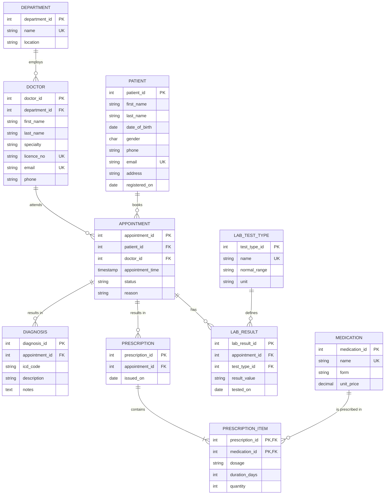

```mermaid
erDiagram
    DEPARTMENT ||--o{ DOCTOR : employs
    DOCTOR ||--o{ APPOINTMENT : "attends"
    PATIENT ||--o{ APPOINTMENT : "books"
    APPOINTMENT ||--o{ DIAGNOSIS : "results in"
    APPOINTMENT ||--o{ PRESCRIPTION : "results in"
    APPOINTMENT ||--o{ LAB_RESULT : "has"
    PRESCRIPTION ||--|{ PRESCRIPTION_ITEM : contains
    MEDICATION ||--o{ PRESCRIPTION_ITEM : "is prescribed in"
    LAB_TEST_TYPE ||--o{ LAB_RESULT : "defines"

    DEPARTMENT {
        int department_id PK
        string name UK
        string location
    }
    DOCTOR {
        int doctor_id PK
        int department_id FK
        string first_name
        string last_name
        string specialty
        string licence_no UK
        string email UK
        string phone
    }
    PATIENT {
        int patient_id PK
        string first_name
        string last_name
        date date_of_birth
        char gender
        string phone
        string email UK
        string address
        date registered_on
    }
    APPOINTMENT {
        int appointment_id PK
        int patient_id FK
        int doctor_id FK
        timestamp appointment_time
        string status
        string reason
    }
    DIAGNOSIS {
        int diagnosis_id PK
        int appointment_id FK
        string icd_code
        string description
        text notes
    }
    MEDICATION {
        int medication_id PK
        string name UK
        string form
        decimal unit_price
    }
    PRESCRIPTION {
        int prescription_id PK
        int appointment_id FK
        date issued_on
    }
    PRESCRIPTION_ITEM {
        int prescription_id PK,FK
        int medication_id PK,FK
        string dosage
        int duration_days
        int quantity
    }
    LAB_TEST_TYPE {
        int test_type_id PK
        string name UK
        string normal_range
        string unit
    }
    LAB_RESULT {
        int lab_result_id PK
        int appointment_id FK
        int test_type_id FK
        string result_value
        date tested_on
    }
```
